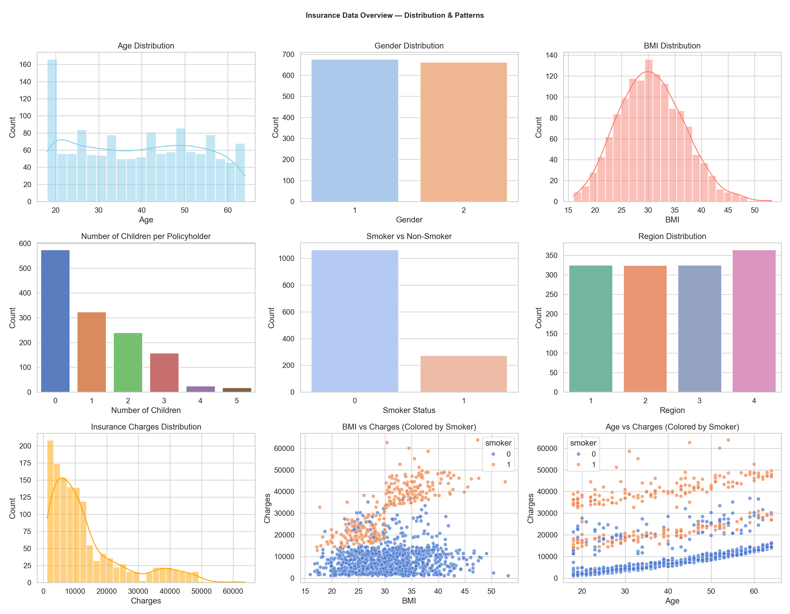
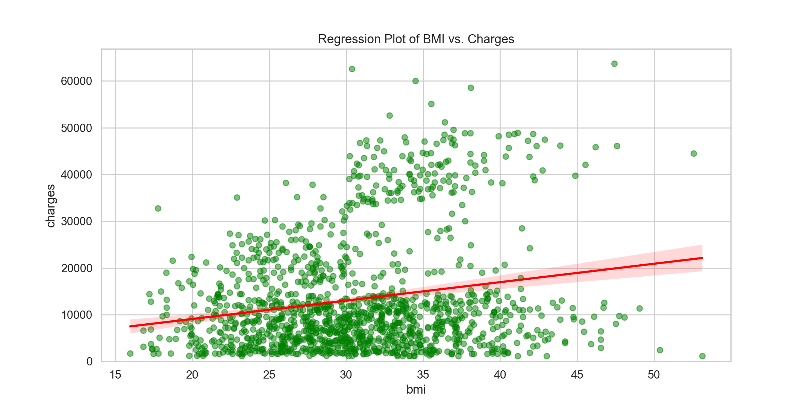
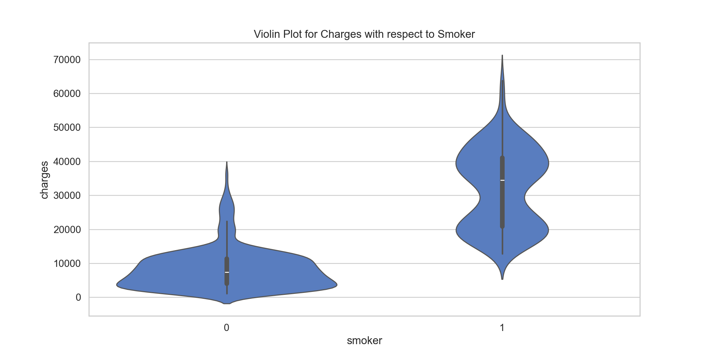
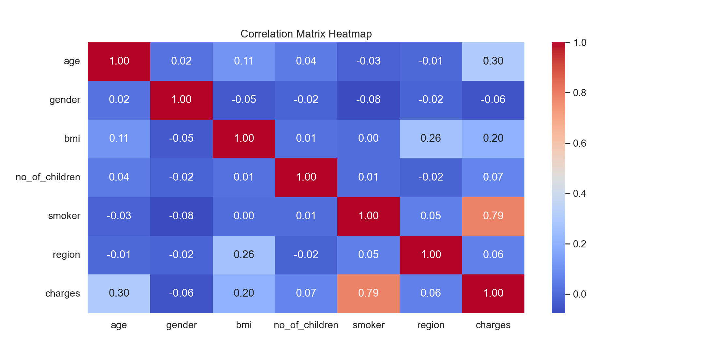

# Insurance Cost Prediction — Data Science Project

## Visualization Preview

| Visualization | Screenshot |
|------|-------------|
| Overview |  |
| BMI vs. Charges |  |
| Charges vs. Smoker |  |
| Correlation |  |

---

## Project Overview
This project explores the **factors influencing insurance charges** and builds **predictive models** using Python to estimate medical insurance costs based on personal and lifestyle attributes.  
It demonstrates a **complete data science workflow** — from **data cleaning and feature encoding** to **exploratory data analysis (EDA)**, **correlation visualization**, and **predictive modeling** using **Linear Regression**, **Polynomial Regression**, and **Ridge Regression**.
It highlights analytical, visualization, and machine learning skills for **Data Analyst**, **Machine Learning**, and **Data Science** roles.

---

## Project Goals
- **Understand** how demographic and lifestyle factors (age, gender, BMI, smoking habits, number of children, and region) affect insurance charges.  
- **Visualize** data distributions and relationships using Matplotlib and Seaborn.  
- **Engineer features** by cleaning and encoding categorical variables.  
- **Build and evaluate regression models** (Linear, Polynomial, and Ridge) to predict insurance charges.  
- **Compare model performance** using R² scores to identify the best predictive approach.

---

## Tools & Technologies
- **Languages:** Python  
- **Libraries:** Pandas, NumPy, Matplotlib, Seaborn, scikit-learn  
- **Environment:** Jupyter Notebook  
- **Techniques:**  
  - Data Cleaning & Preprocessing  
  - Exploratory Data Analysis (EDA)  
  - Correlation Analysis  
  - Linear & Polynomial Regression  
  - Ridge Regression (Regularization)  
  - Model Evaluation (R² Score, Cross Validation)

---

## Data Preprocessing
1. **Handled Missing Values**
   - Replaced missing categorical values (`smoker`) with the most frequent category.
   - Replaced missing numerical values (`age`) with the mean age.
2. **Encoded Categorical Variables**
   - Mapped gender, smoker, and region to numeric codes.
3. **Standardized Data**
   - Scaled numerical features using `StandardScaler()` for model stability.

---

## Exploratory Data Analysis (EDA)
EDA was performed using Seaborn and Matplotlib to uncover relationships and distributions:
- **Distributions:** Age, BMI, Charges, Gender, Region, and Smoker status  
- **Relationship Plots:**  
  - BMI vs. Charges  
  - Age vs. Charges  
- **Correlation Heatmap:** Quantified relationships between all numeric features

**Key Insights:**
- Smokers have significantly higher insurance charges.  
- Age and BMI are positively correlated with insurance costs.  
- Regional differences exist but have weaker influence.

---

## Modeling & Evaluation

### 1. **Linear Regression**
- Baseline model using single feature (`smoker`) and multivariate features.

### 2. **Polynomial Regression**
- Captured non-linear relationships.

### 3. **Ridge Regression**
- Added L2 regularization to reduce overfitting.

---

## Dataset Source

[Kaggle — Medical Insurance Cost Dataset](https://www.kaggle.com/datasets/mosapabdelghany/medical-insurance-cost-dataset)

---

## Author

**Euikyun. Ko.**  
Data Scientist / Developer  
📧 [eko004@fiu.edu]
📧 [koek0507@gmail.com] 
🌐 [www.linkedin.com/in/euikyun-ko]

---

